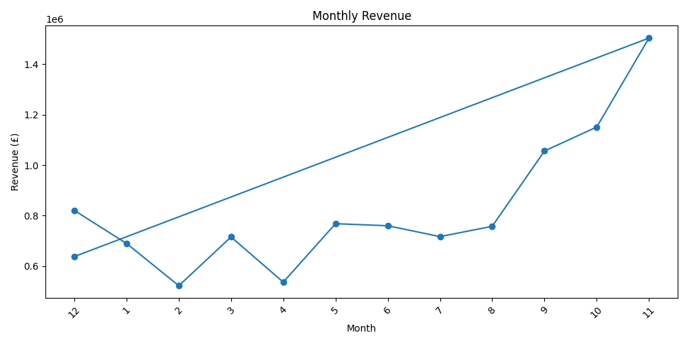
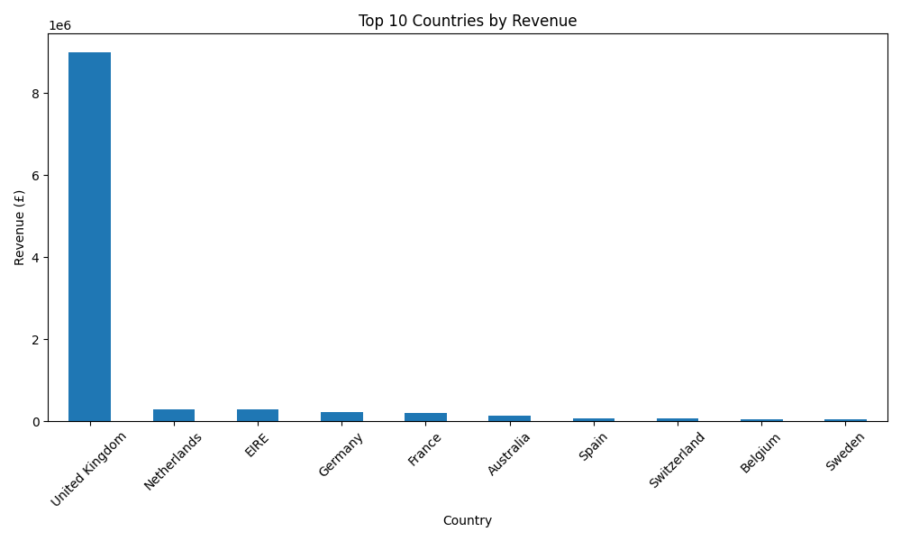
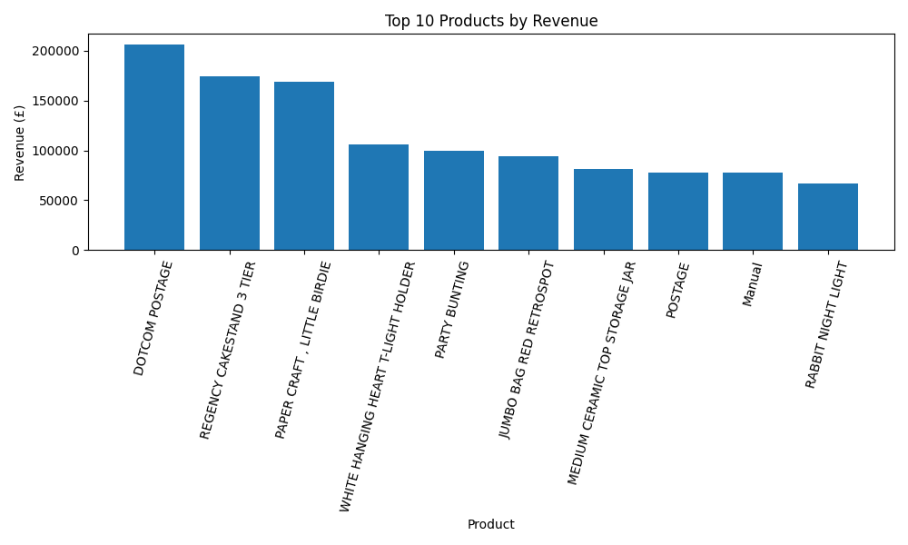
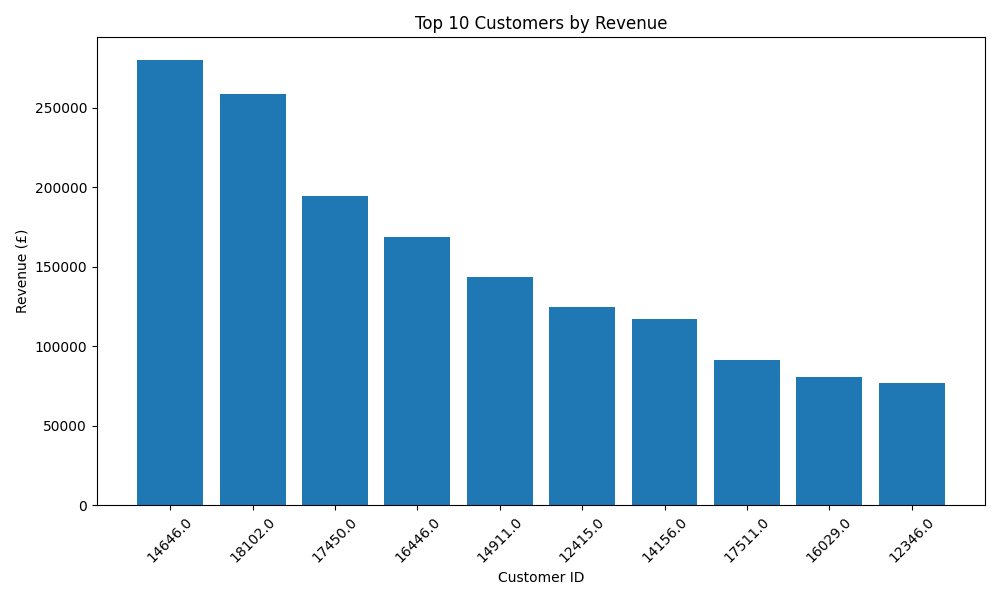

# 🛒 Online Retail Data Analysis

A beginner-friendly data analysis project using real-world online retail transaction data from the UCI Machine Learning Repository.

## 📌 Project Overview

This project analyzes online retail transaction data to understand:

* Revenue performance
* Monthly sales trends
* Country-wise sales
* Product revenue
* Customer revenue
* Business insights

Python and Pandas were used for data cleaning and analysis, while Matplotlib was used to create visualizations.

## 📊 Dataset

**Dataset:** UCI Online Retail Dataset

The dataset contains real-world online retail transactions from 2010–2011.

## 🛠️ Technologies Used

* Python
* Pandas
* Matplotlib
* UCI Machine Learning Repository
* Git
* GitHub

## 🧹 Data Cleaning

The following data cleaning steps were performed:

* Checked missing values
* Removed rows with missing product descriptions
* Removed duplicate rows
* Converted `InvoiceDate` to datetime format
* Identified negative quantities as returns/cancellations
* Removed non-positive quantities from sales analysis
* Removed non-positive unit prices from sales analysis
* Created a `TotalAmount` column

## 📈 Analysis Performed

### Revenue Analysis

Calculated total revenue and analyzed revenue performance over time.

### Monthly Revenue Analysis

Analyzed revenue by year and month to identify high and low performing months.

### Country-wise Analysis

Compared revenue across different countries.

### Product Analysis

Identified the highest-revenue items in the dataset.

### Customer Analysis

Identified customers with the highest recorded revenue.

## 📊 Visualizations

### Monthly Revenue



### Top 10 Countries by Revenue



### Top 10 Items by Revenue



### Top 10 Customers by Revenue



## 💡 Key Business Insights

| Metric                    |         Result |
| ------------------------- | -------------: |
| Total Revenue             | £10,636,228.14 |
| Sales Rows After Cleaning |        524,231 |
| Highest Revenue Country   | United Kingdom |
| Highest Revenue Month     |  November 2011 |
| Top Customer ID           |          14646 |
| Top Customer Revenue      |    £280,206.02 |

## 🔄 Project Workflow

```text
Real Dataset
     ↓
Data Understanding
     ↓
Data Cleaning
     ↓
Data Transformation
     ↓
Revenue Analysis
     ↓
Customer & Product Analysis
     ↓
Data Visualization
     ↓
Business Insights
     ↓
GitHub
```

## 📁 Project Files

```text
online-retail-data-analysis/
│
├── online_retail_analysis.py
├── cleaned_online_retail.csv
├── monthly_revenue.png
├── country_revenue.png
├── top_products_revenue.png
├── top_customers_revenue.png
└── README.md
```

## 🎯 Conclusion

This project demonstrates a complete beginner-level data analysis workflow using real-world retail transaction data.

It shows how Python and Pandas can be used to clean data, transform data, calculate business metrics, analyze trends, and create visualizations for business decision-making.

## 👨‍💻 Author

**Bhanu Satya Prasad Reddy**

Aspiring Data Engineer
